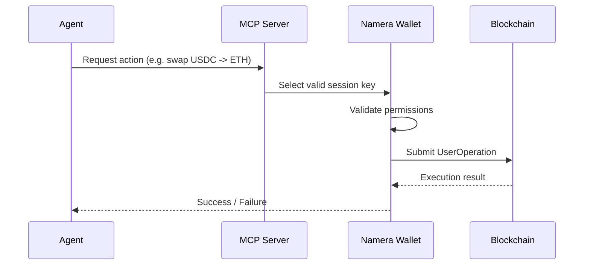

## The Missing Layer for Autonomous Onchain Agents

There’s a quiet shift happening in crypto. We are moving from user-driven interactions to agent-driven execution. Bots, AI copilots, automation scripts, and autonomous systems are no longer experimental—they’re becoming the default interface to blockchains.

But the infrastructure underneath hasn’t caught up.

Wallets are still designed for humans. Every interaction assumes a user sitting behind a screen, approving transactions one-by-one. This breaks down completely when you introduce agents that need to act continuously, independently, and safely.

Namera exists because this gap is real—and painful.

---

## The Problem: Wallets Were Never Built for Agents

When you try to run an autonomous agent on top of today’s wallet stack, everything starts to feel fragile.

You either give your agent full private key access—which is dangerous—or you build complex off-chain permission systems that aren’t enforceable onchain. Neither is acceptable for production systems.

Parallel execution becomes messy. Nonce management turns into a bottleneck. You can't safely run multiple strategies at once without risking collisions or failed transactions.

And most importantly, you cannot define *intent*. You can only sign transactions.

That’s the core issue.

Wallets today operate at the level of “do this exact call.” Agents need to operate at the level of “this is what I’m allowed to do.”

---

## Enter Namera

Namera is a smart wallet infrastructure designed specifically for autonomous agents.

It is not just a wallet. It is a programmable execution layer that sits between agents and blockchains, enabling safe, parallel, and intent-driven transaction execution.

Instead of thinking in terms of private keys and raw transactions, Namera introduces structured permissions, session keys, and execution models that align with how agents actually behave.

---

## How Namera Works

At its core, Namera is built around three fundamental ideas: session keys, onchain-enforced permissions, and parallel execution via multi-dimensional nonces.

Let’s walk through how this system actually operates.

---

### Session Keys: Delegation Without Risk

Instead of exposing your main wallet key, Namera allows you to generate session keys with scoped permissions.

These keys are ephemeral, purpose-specific, and restricted by rules defined onchain.

A session key might be allowed to interact with Uniswap swaps but not transfer ETH. Another might be allowed to supply assets to Aave but not withdraw them.

The important part is this:

The permissions are enforced onchain, not offchain.

Even if an agent misbehaves, the transaction will simply fail during execution. There is no trust required in the agent itself.

---

### Onchain Permission Enforcement

Traditional systems rely on middleware or APIs to enforce rules. Namera moves this enforcement into the smart contract layer.

This means every transaction is validated against permission rules before execution.

```solidity
function execute(UserOperation op) external {
    require(validatePermissions(op), "INVALID_PERMISSIONS");
    _execute(op);
}
```

This simple idea changes everything.

There is no race condition where a bad transaction might slip through. There is no reliance on a centralized validator. The blockchain itself becomes the enforcement layer.


---

### Parallel Execution with Multi-Dimensional Nonces


One of the biggest bottlenecks in agent systems is nonce management.

In traditional wallets, transactions must be executed sequentially. This makes parallel strategies nearly impossible.

Namera solves this using multi-dimensional nonces.

Instead of a single global nonce, each “lane” or “group” has its own nonce space. This allows independent execution streams to run in parallel.

For example, an agent can simultaneously:

1. Execute a swap on Uniswap
2. Provide liquidity on Aave
3. Bridge assets to another chain

Each operation lives in its own nonce domain, eliminating conflicts.

### Execution Flow

Here’s what happens when an agent executes a transaction through Namera:



The MCP server acts as the orchestration layer, selecting the correct session key based on the requested action.

The wallet enforces permissions, and the blockchain guarantees correctness.

---

## Developer Experience

From a developer’s perspective, Namera integrates seamlessly with existing agent systems.

You don’t need to redesign your architecture. You simply define permissions and let Namera handle execution.

```ts
const sessionKey = await namera.createSessionKey({
  permissions: [
    {
      contract: UNISWAP_ROUTER,
      functionSelector: "swapExactTokensForTokens",
    },
  ],
})
```

Once created, this key can be used by any agent, tool, or service that needs that capability.

---

## Security Model

Namera assumes that agents can and will fail.

Instead of trying to make agents perfect, it constrains what they can do.

Even in worst-case scenarios:

Unauthorized actions fail onchain
Funds remain protected
Execution remains deterministic

This is a fundamentally different approach from traditional wallet security.

---

## The Bigger Picture

We are moving toward a world where:

- AI agents manage portfolios
- Bots coordinate liquidity across chains
- Autonomous systems execute financial strategies

But none of this works without a secure execution layer.

Namera is that layer.

---

## Closing Thoughts

Namera is not just another wallet.

It is an infrastructure primitive for the next generation of onchain systems.

By combining session keys, onchain permissions, and parallel execution, it enables something that hasn’t been possible before:

Safe, scalable, autonomous execution.

The shift from users to agents is inevitable.

The question is whether the infrastructure is ready.

With Namera, it is.